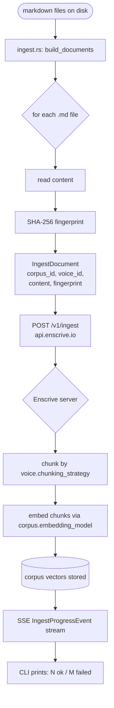
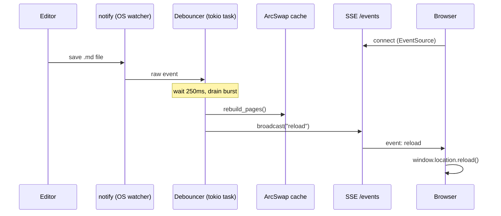

# Architecture — `enscrive-docs`

> Source: `main` branch, version 0.0.2

## Crate Map

```
enscrive-docs/
├── crates/core/          enscrive-docs-core  (library)
│   ├── src/client.rs     HTTP client for api.enscrive.io
│   ├── src/config.rs     Config loader (enscrive-docs.toml)
│   ├── src/types.rs      API request/response types (mirrored from upstream)
│   └── src/error.rs      EnscriveError enum + Result alias
│
├── crates/render/        enscrive-docs-render  (library)
│   ├── src/markdown.rs   pulldown-cmark pipeline → sanitized HTML + frontmatter + anchors
│   ├── src/page.rs       Page + PageMeta in-memory types
│   ├── src/templates.rs  Askama template wiring (PageContext, IndexContext, build_nav)
│   ├── src/theme.rs      ThemeVariant enum + Theme struct
│   ├── src/assets.rs     rust-embed bundle (CSS, JS, templates)
│   └── templates/        Askama source: _base.html, page.html, index.html
│
└── crates/cli/           enscrive-docs  (binary)
    ├── src/main.rs        Clap command dispatch
    ├── src/global.rs      GlobalArgs (--api-key, --endpoint, --profile, --config)
    ├── src/version.rs     VERSION string (semver + git sha + build date)
    ├── build.rs           Git SHA + build date stamped into env vars at compile time
    └── src/commands/
        ├── init.rs        Scaffold enscrive-docs.toml
        ├── bootstrap.rs   Create voices + corpora + first ingest (idempotent)
        ├── ingest.rs      Walk markdown → POST /v1/ingest
        ├── serve.rs       Axum HTTP server + all route handlers
        ├── watch.rs       serve + notify watcher + SSE live reload
        ├── search.rs      One-shot neural search (CLI output)
        ├── voice.rs       `voice tune` — edit voice in $EDITOR + PUT back
        ├── reset.rs       Delete corpora + re-run bootstrap
        └── config.rs      Print / validate resolved configuration
```

## Dependency Graph

```
enscrive-docs (binary)
├── enscrive-docs-core  (ingest, search, corpus/voice CRUD, config)
│   ├── reqwest 0.12    (HTTP client, rustls-tls, JSON, SSE streaming)
│   ├── tokio 1         (async runtime)
│   ├── serde / serde_json
│   ├── toml 0.8
│   └── futures-util
├── enscrive-docs-render  (markdown → HTML, templates, assets)
│   ├── pulldown-cmark 0.12  (CommonMark parser + HTML emitter)
│   ├── ammonia 4            (HTML sanitizer)
│   ├── askama 0.12          (compile-time Jinja2 templates)
│   ├── rust-embed 8         (bakes assets/ into binary at build time)
│   ├── gray_matter 0.2      (YAML frontmatter parser)
│   └── slug 0.1             (heading text → URL slug)
├── axum 0.7 + tower-http 0.5  (HTTP server, CORS)
├── walkdir 2                   (recursive markdown discovery)
├── sha2 0.10 + hex 0.4         (per-document content fingerprints)
├── notify 6                    (filesystem watcher, kqueue/inotify)
├── arc-swap 1                  (lock-free ArcSwap for in-memory page cache)
└── tracing / tracing-subscriber
```

## Ingest Pipeline



**Key invariant:** the `enscrive-docs` client sends raw markdown content and a
SHA-256 fingerprint. All chunking and embedding happen server-side. The fingerprint
lets the Enscrive API detect unchanged documents and skip re-embedding them —
this is what makes `ingest` idempotent on unchanged files.

## Serve + Search Pipeline

```mermaid
flowchart LR
    subgraph startup ["Startup (once)"]
        A[load enscrive-docs.toml] --> B[list /v1/corpora + /v1/voices]
        B --> C[walk corpus paths\nrender markdown → HTML]
        C --> D[ArcSwap: pages\npages_meta\ndoc_id_to_slug]
    end

    subgraph request ["Per-request"]
        E([browser ⌘K]) --> F[search.js\nGET /search?q=...]
        G([agent / curl]) --> F
        F --> H[handle_search]
        H --> I{voice resolved?}
        I -->|yes| J[POST /v1/voices/search\nvoice-tuned neural search]
        I -->|no| K[POST /v1/search\nplain corpus search]
        J --> L[SearchResults\nfrom Enscrive]
        K --> L
        L --> M[enrich: page URL\n+ Text Fragment suffix]
        M --> N([JSON response])
    end

    subgraph page ["Page serving"]
        O([GET /{slug}]) --> P[ArcSwap load]
        P --> Q{format param}
        Q -->|html| R[render_page Askama]
        Q -->|md| S[raw markdown]
        Q -->|json| T[PageMeta + HTML + MD JSON]
    end
```

## Watch Mode (live reload)



Note: watch-mode page rebuild is in-memory only. Enscrive ingest is **not**
automatically triggered on file save — that remains a deliberate `ingest`
invocation.

## Config Resolution

Resolution precedence for every credential/endpoint, highest wins:

```
1. CLI flag          --api-key, --endpoint, --embedding-provider-key, --profile
2. Environment var   ENSCRIVE_API_KEY, ENSCRIVE_BASE_URL, ENSCRIVE_EMBEDDING_PROVIDER_KEY
3. enscrive-docs.toml  [enscrive] api_key / endpoint / embedding_provider_key
4. ~/.config/enscrive/profiles.toml  [profiles.<name>] api_key / endpoint
5. Built-in default  https://api.enscrive.io (endpoint only)
```

## Embedded Assets

All frontend assets are baked into the binary at compile time via `rust-embed`:

| Asset path | Purpose |
|---|---|
| `themes/neutral/style.css` | Default brand-neutral theme (light + dark mode) |
| `themes/enscrive/style.css` | Enscrive brand variant (imports neutral, overrides palette) |
| `js/search.js` | ⌘K palette — ~150 lines of vanilla JS, no framework |

Templates (`_base.html`, `page.html`, `index.html`) are compiled into the binary at
build time by Askama (Jinja2-style compile-time templating) and live in
`crates/render/templates/`.

## CI / Release Pipeline

```
PR opened → ci.yml
  ├── build    cargo build --locked --all-targets
  ├── test     cargo test --locked
  └── clippy   cargo clippy -- -D warnings

merge to main → tag.yml
  └── auto-tag vYYYYMMDD-HHMM → dispatch release.yml

release.yml (on tag)
  ├── build matrix: x86_64-unknown-linux-gnu  (self-hosted enscrive-builder)
  ├── upload binary + SHA256 → S3 (dev channel)
  ├── CloudFront invalidation
  ├── GitHub Release (softprops/action-gh-release)
  └── notify-orchestrator → dispatch to enscrive-cli for manifest update (ENS-538)
```

**Noted gap:** cosign signing is absent (ENS-82 follow-on). macOS and aarch64
targets are not yet in the release matrix despite being advertised in README.
